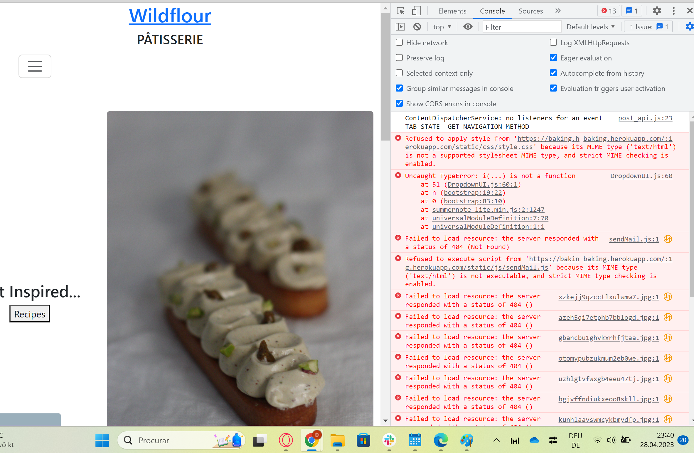

<h1 align="center">WildFlour Blogue</h1>

Wildflour-blog has its main purpose to inform, educate, and entertain the audience. Here, people with a passion for baking will find different categories within baking, with specific recipes to explore, the ability to share their own recipes with the community, improve their baking skills, and interact with the authors of the recipes in the comment section.

 

### Table of Contents

- [UX](#ux)
    - [Target Audience](#target-audience)
    - [Website owner business goals](#website-owner-business-goals)
    - [User Experience](#user-experience)
        - [User Stories](#)
    - [Design](#design)
        - [Colours](#colours)
        - [Fonts](#fonts)
        - [Images](#images)
        - [Wireframes](#wireframes)
        - [Database](#database)
- [Agile](#target-audience)
- [Features](#features)
    - [Navigation Bar](#navigation-bar)
    - [The Landing Page](#the-landing-page)
    - [Categories](#second-section--sneak-peek-into-my-classroom)
    - [Footer](#footer)
    - [Blog](#blog)
    - [Blog Category](#blog-category)
    - [Recipe](#recipe)
    - [Create Recipes](#create-recipe)
    - [About Page](#about-page)
    - [Contact Page](#contact)
    - [User](#user)
    - [Login](#login)
    - [Register](#register)
    - [Logout](#logout)
- [Features Left to Implement](#features-left-to-implement)
- [Testing](#testing)
- [Fixed Bugs](#fixed-bugs)
- [Deployment](#deployment)
- [Credits](#credits)
- [Acknowledgments](#acknowledgements)

# UX
## Target Audience
- People who want to showcase their creativity by sharing their unique and innovative recipes with the world
- People in different stages of their baking from beginners to intermediate bakers
- Curious bakers, that want to step up their game and try more complex recipes
- People who wish to have a more profound understanding of baking, also on a chemical level
- Bakers interested in achieving high-quality products
- People thinking about changing professions to become professional bakers

## Website owner business goals:
- Increase the notoriety of the baker to the public by creating the website.
- Make classic French recipes available to an English-speaking audience.
- Share personal insights into studying at one of the most popular French pastry schools.
- Provide foresight of future employment possibilities, such as catering and wedding cakes.

# User Experience
## User Stories

 #### EPIC: Create a Base.htm with navigation and footer
 

1. As a user, I want to easily navigate and explore a website with a clean and intuitive layout that allows me to find the information I need quickly and efficiently .

2. As a visitor, I want to scroll down on the homepage, so that I can quickly see the content of the blog.

3. As a user, I want a straightforward footer so that I can easily find the website's links to other categories and social media platforms.

#### EPIC: User Registration
 

4. As a user, I want to log in to the blog so that I can access more features and content that are only available to registered users.

5. As a user, I want to sign up for the website quickly and easily so that I can start using the full functionality of the blog and enjoy a seamless user experience.

6. As a user, I want to log out from the blog whenever I want so that my personal details are not displayed to anyone who may use the device after me.

#### EPIC: User Authentication & CRUD Functionality
 

7. As a site owner, I want to restrict access to certain sections of the app to unauthenticated users so that basic data protection standards are met and unauthorized access to sensitive information is prevented.

8. As a user, I want to create, read, update, and delete blog posts to share my recipes with the community

9. As a user, I want to be able to easily edit my published blog posts, so that I can correct errors, improve the content and keep my readers engaged.

10. As a user, I want to delete a blog post so that I can remove content that is no longer relevant or necessary.

11. As a user, I want to be able to update my profile information so that my account reflects accurate and current information about me.

#### EPIC: Blog Post Features
 

12. As a user, I want to be able to store different recipes in separate categories so that I can easily access them based on my needs.

13. As a user, I want to be able to like or unlike posts in the blog so that I can show recognition for the content the author created.

14. As a user, I want to be able to comment on a post so that I can share my thoughts and engage with other users.

#### EPIC: Contact Form
 

15. As a user, I want to be able to easily access a contact page on the website so that I can send a message to the website's administrators.

## Design
### **Colours**
<strong>
</strong> 

 

Color Gradients for this website were generated with [Colorate](https://colorate.azurewebsites.net/)

### **Fonts**

- Logo Heading Font: 'Licorice', cursive;
- Logo Sub-Heading Font: 'Montserrat', sans-serif;
- BlackBoard Font(Categories): 'Roboto Condensed', sans-serif;
- Heading/Alert messages Font: 'Playfair Display', serif;

All fonts used in this website were taken from [Google Fonts](https://fonts.google.com/)

### **Wireframes**

- Basamiq wireframes was used to create the blueprint for this project

### **Database**

I used Elephant PostgreSQL as the relational database management system for this Django app. The model, depicted in the diagram, visually illustrates the structure of the PostgreSQL database, such as tables, columns, relationships. 
 
In terms of data models, there is a User model, which is part of the Django allauth library. This model includes basic information about authenticated users, and has the following fields: username, password, and email.

 

### **Images**

- The images presented on this website are under my ownership.

# Agile
Adopting agile principles and learning Django for the first time presented some initial challenges for me. I needed to work quickly due to the accelerated pace of the project, so I prioritized creating basic functionality first and focusing on meeting pass criteria. As I progressed, I added user stories to GitHub's project and worked on each one for an average of two days.
 

While I didn't plan my project from start to finish, using the agile methodology gave me the flexibility to work through each user story as it was added. I found it helpful to prioritize functionality and pass criteria, rather than trying to include everything at once. This allowed me to make progress quickly and adjust my approach as needed. Moving forward, I plan to continue using agile principles to stay flexible and responsive to changing project requirements.

 

## Agile principles- GitHub Issues

 

## Agile principles- GitHub Issues

# Features

## Navigation Bar
 

- Allows users to easily navigate to different sections of the website.

- Includes links to the landing page, categories, blog, about, contact and user account pages

Navigation Bar -Screenshot

 

<!--  -->
- Mobile version, dropdown menu.

Navigation Bar -Screenshot

 
<!--  -->

## The Landing Page

- Introduction to the website and its content.

- Feature images, carousel, and links to other sections of the website.

The Landing Page

<!--  -->

## Categories

- Organizes content into specific topics or themes.

- Allows users to easily find and browse related content.

Categories -Screenshot

 
<!--  -->

## Footer

- Includes additional links, contact information and social media icons.

Footer -Screenshot

 

<!--  -->

## Blog

- Features posts on a variety of categories.

Blog .gif

 

<!--  -->

## Blog Category

- Similar to regular categories, but specifically for organizing blog content.
- Helps users find posts on specific topics.

Blog Category -Screenshot

 
<!--  -->

## Recipe

- Features detailed instructions and ingredients for preparing a specific dish

- Includes an image, ingrediensts, instructions to help users visualize the cooking process.

- Comment section

Recipe -Screenshot

 

Recipe .gif

 

<!--  -->

## Create Recipes

- Allows users to contribute their own recipes to the website.

- Includes a form for users to input Title, category, time needed, ingredients, cooking instructions, feature image and a excerpt.

Create Recipe .gif

 

<!--  -->

## About Page

- Provides information about the website and its mission.

About Page -Screenshot

 

<!--  -->

## Contact Page

- Allows users to get in touch with the website's creators or administrators
- Includes a contact form

Contact Page -Screenshot

 

<!--  -->

## User

- Section of the website dedicated to user accounts.

- Includes options for managing profile information, like, name, username and email.

User -Screenshot

 

<!--  -->

## Login

- Allows users to sign in to their account.

- Requires a username and password.

- Option to login with GitHub.

Login -Screenshot

 

<!--  -->

## Register

- Allows new users to create an account.

- Requires users to provide their name, email address, and choose a password.

Register -Screenshot

 

<!--  -->

## Logout

- Allows users to sign out of their account.

- Redirects users back to the landing page.

Logout in navbar -Screenshot

 

# Features Left to Implement

- User profiles: Users should be able to create their own profile, including the ability to upload a profile image and add a description about themselves. They should also be able to add their social media accounts or contact details.

- Favorites: Users should have their own space where they can view posts they've added to their favorites, so they can access them easily.

- User Recipe management: Users should be able to view, edit, or delete recipes they've created on their personalized space.

- Newsletter subscription: There should be an option for users to subscribe to a newsletter at the footer of the website. This will allow users to receive updates about the blog and new features.

- Contact form: Currently, the contact form uses a console to print out users' contact requests. In the future, this should be replaced with an SMTP provider so that the website can send actual emails to the website administrators.

- Login: Social authentication login with gmail, facebook, instagram...

# Testing

Click [**here**](TESTING.md) to go to the testing.

# Fixed Bugs

Throughout this project, several issues have arisen. While some were resolved through my own efforts, others were more challenging and required the assistance of the tutor team at Code Institute. I would like to express my immense gratitude to them for helping me quickly identify my mistakes and save my precious time.

<strong>Database Bug:</strong>

- Required to make the reset of the Elephant PostgreSQL database in order to fix the issue. 
 

<strong>NoMatchError:</strong>

- Required to properly set up "pk" in the view and urls to fix this issue. 
 

<strong>etag Error:</strong>

- To this day still having troubles understanding this error. Changing configvars in Heroku seem to fix this issue. 
 

<strong>CSS not loading:</strong>

- This issue is apperantly related to etag error. fixed after the configvars manipulations and static file removal from Cloudinary.
 

<strong>Summernote not loading:</strong>

- This issue appeared when the deployed version was set to True, appears to be fixed after the configvars manipulations and Debug set to false.
 

## Credits

sticky nav bar- https://www.w3schools.com/howto/tryit.asp?filename=tryhow_js_navbar_sticky
