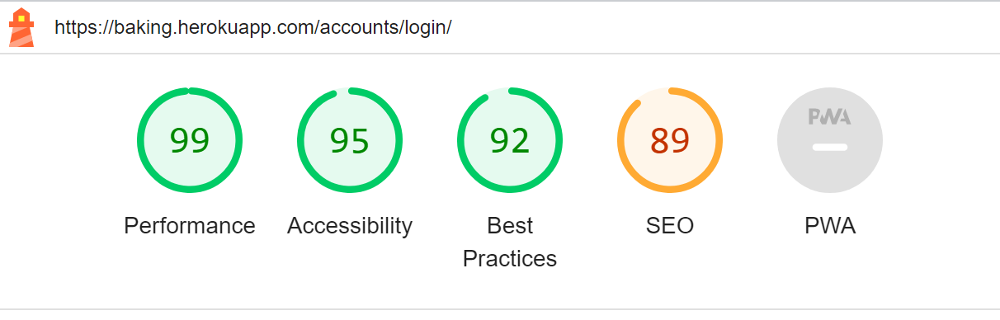

# Testing

## Table of contents:

- [Validator Testing](#validator-testing)
    - [Lighthouse](#lighthouse)
    - [W3C](#w3c-html)
    - [Jigsaw](#jigsaw-css)
    - [JS Validation](#js-validation)
    - [Pep8 Validation](#pep8-validation)
- [Responsiveness](#responsiveness)
- [Manual Testing](#manual-testing)

## Validator Testing

### Lighthouse Testing

- Landing page testing

 

- Categories page testing

 

- Blog page testing

 

- Recipe page testing

 

- Create Recipe page testing

 

- About page testing

 

- Contact page testing

 

- Login page testing

 

### W3C HTML validator

- A total of 7 html errors were found on the website which were quickly fixed

### W3C Jigsaw validator

- After trying to run CSS validator by the website URL the validator crashed three times. By direct upload of CSS code 2 errors were found and fixed.

### JS Validation

- As I didn't write much JavaScript code for this project, only used it for the navbar and alert messages. Consequently, our testing process went smoothly, and validator didn't encounter any errors. By keeping our JavaScript code to a minimum and focusing on its specific functionality, I was able to streamline the testing efforts and ensure that the code I did write was thoroughly tested and bug-free.

### PEP8 Validation

- To ensure code consistency and readability, we followed the Pep8 guidelines and used packages for tracking errors and warnings. One of the most frequent issues I encountered was lines that were too long, which I addressed by breaking them up into smaller segments. Also fixed a few trailing spaces warnings that came across during the review process. Overall, these efforts helped to produce high-quality code that is easy to read, understand, and maintain.

## Responsiveness

## Manual Testing

| User Story | Test | Pass |
| --- | --- | :---: |
| 1. As a user, I want to easily navigate and explore a website with a clean and intuitive layout that allows me to find the information I need quickly and efficiently. | Given that I am on the website homepage, when I navigate through the website, then I should be able to find the desired information quickly and efficiently. | Pass |
| 2. As a visitor, I want to scroll down on the homepage, so that I can quickly see the content of the blog. | Given that I am on the website homepage, when I scroll down, then I should be able to view the content of the blog. | Pass |
| 3. As a user, I want a straightforward footer so that I can easily find the website's links to other categories and social media platforms. | Given that I am on any page of the website, when I navigate to the footer section, then I should be able to find the website's links to other categories and social media platforms. | Pass |
| 4. As a user, I want to log in to the blog so that I can access more features and content that are only available to registered users. | Given that I am on the website login page, when I enter valid credentials and click on the login button, then I should be able to log in to the blog. | Pass |
| 5. As a user, I want to sign up for the website quickly and easily so that I can start using the full functionality of the blog and enjoy a seamless user experience. | Given that I am on the website registration page, when I enter valid details and click on the sign-up button, then I should be able to register successfully. | Pass |
| 6. As a user, I want to log out from the blog whenever I want so that my personal details are not displayed to anyone who may use the device after me. | Given that I am logged in to the blog, when I click on the logout button, then I should be logged out successfully. | Pass |
| 7. As a site owner, I want to restrict access to certain sections of the app to unauthenticated users so that basic data protection standards are met and unauthorized access to sensitive information is prevented. | Given that I am an unauthenticated user, when I try to access restricted sections of the app, then I should be redirected to the login page. | Pass |
| 8. As a user, I want to create, read, update, and delete blog posts to share my recipes with the community. | Given that I am logged in to the blog and on the blog post page, when I create a post, then I should be able to read, update, and delete the post successfully. | Pass |
| 9. As a user, I want to be able to easily edit my published blog posts, so that I can correct errors, improve the content and keep my readers engaged. | Given that I am logged in to the blog and on the blog post page, when I click on the edit button for a post, then I should be able to edit the post successfully. | Pass |
| 10. As a user, I want to delete a blog post so that I can remove content that is no longer relevant or necessary. | Given that I am logged in to the blog and on the blog post page, when I click on the delete button for a post, then I should be able to delete the post successfully. | Pass
| 11. As a user, I want to be able to update my profile information so that my account reflects accurate and current information about me. | Given that I am logged in to the blog and on my profile page, when I edit my profile information and click on the save button, then my profile information should be updated successfully. | Pass
| 12. As a user, I want to be able to store different recipes in separate categories so that I can easily access them based on my needs. | Given that I am logged in to the blog and on the blog post page, when I create a new post, I should be able to select a category to store it in, and when I navigate to the category page, I should see only the posts belonging to that category. | Pass
|13. As a user, I want to be able to like or unlike posts in the blog so that I can show recognition for the content the author created. | Given that I am on the blog post page, when I click on the "Like" button, then the counter of likes should increase by one, and if I click again on the same button, then the counter should decrease by one. | Pass
| 14. As a user, I want to be able to comment on a post so that I can share my thoughts and engage with other users. | Given that I am on the blog post page, when I scroll down to the comments section and enter a comment, then the comment should be displayed under the post. Only loged in users should be able to leave a comment. | Pass
| 15. As a user, I want to be able to easily access a contact page on the website so that I can send a message to the website's administrators. | Given that I am on any page of the website, when I click on the "Contact" link in the navbar or/and footer, then I should be redirected to the contact page where I can enter my name, email and message, and when I click on the "Send" button, then the message should be sent. | Pass
