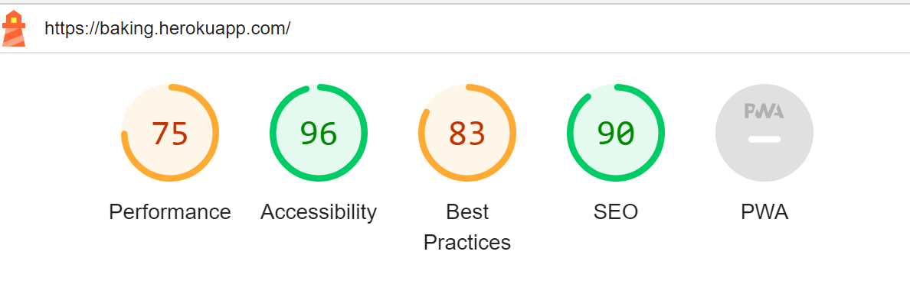

# Testing

## Table of contents:

- [Validator Testing](#validator-testing)
    - [Lighthouse](#lighthouse)
    - [W3C](#w3c-html)
    - [Jigsaw](#jigsaw-css)
- [Responsiveness](#responsiveness)

## Validator Testing

### Lighthouse Testing

- Landing page testing

 

- Categories page testing

 

- Blog page testing

 

- Recipe page testing

 

- Create Recipe page testing

 

- About page testing

 

- Contact page testing

 

- Login page testing

 

### W3C HTML validator

- A total of 7 html errors were found on the website which were quickly fixed

### W3C Jigsaw validator

- After trying to run CSS validator by the website URL the validator crashed three times. By direct upload of CSS code 2 errors were found and fixed.

### JS Validation

- As I didn't write much JavaScript code for this project, only used it for the navbar and alert messages. Consequently, our testing process went smoothly, and validator didn't encounter any errors. By keeping our JavaScript code to a minimum and focusing on its specific functionality, I was able to streamline the testing efforts and ensure that the code I did write was thoroughly tested and bug-free.

### PEP8 Validation

- To ensure code consistency and readability, we followed the Pep8 guidelines and used packages for tracking errors and warnings. One of the most frequent issues I encountered was lines that were too long, which I addressed by breaking them up into smaller segments. Also fixed a few trailing spaces warnings that came across during the review process. Overall, these efforts helped to produce high-quality code that is easy to read, understand, and maintain.

